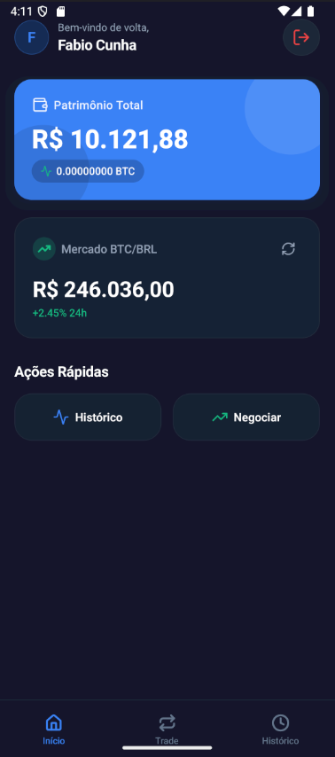
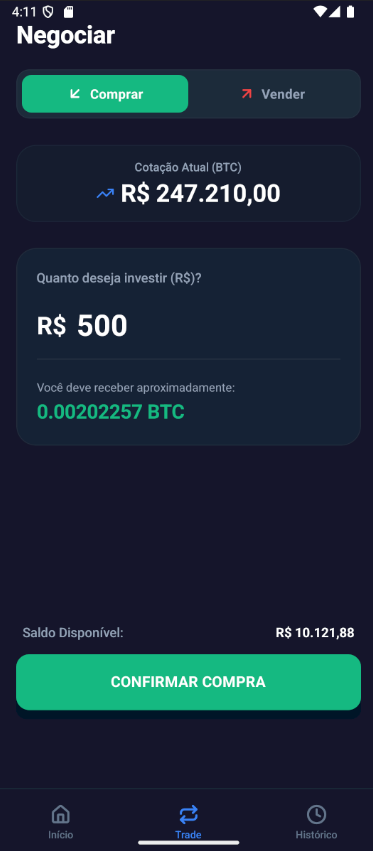
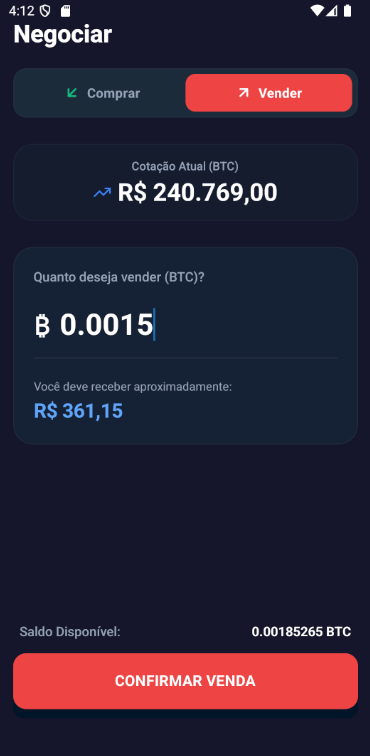
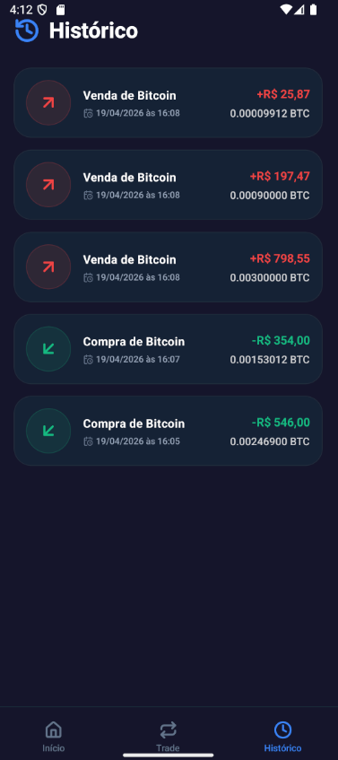

# Projeto Mini Binance

Plataforma de trading simplificada para compra e venda de Bitcoin, composta por um backend em **Laravel** (REST API) e um aplicativo móvel em **React Native** com design premium.

## 📸 Demonstração da Interface Moderna (Mobile)

### 🏠 Dashboard
Dashboard premium com saldo em tempo real, cotação do BTC e atalhos rápidos.


### 📈 Negociação (Trade)
Interface de compra e venda com cálculos dinâmicos e feedback visual.
| Compra (Buy) | Venda (Sell) |
| :---: | :---: |
|  |  |

### 📜 Histórico
Lista de transações detalhada com status e valores.



---

## 🛠️ Tecnologias Principais

- **Backend:** Laravel 11, SQLite, Sanctum (Auth), Pest (Tests).
- **Frontend Mobile:** React Native, Expo, NativeWind v4 (Tailwind), Lucide Icons.

---

## 🚀 Como Executar o Projeto

### 1. Configurando o Backend (Laravel)
Entre na pasta `back_laravel`:
```bash
composer install
cp .env.example .env
php artisan key:generate
touch database/database.sqlite
php artisan migrate --seed
php artisan serve --host 0.0.0.0
```

### 2. Configurando o App (React Native)
Entre na pasta `front_react_native`:
1.  Descubra seu IP local (`ipconfig` ou `ifconfig`).
2.  No arquivo `src/constants/config.ts`, coloque seu IP.
3.  Execute:
```bash
npm install
npm run start
```
4.  Abra o Expo Go no celular ou use um emulador.

---

## 🔑 Acesso ao App

Você pode criar uma nova conta diretamente no aplicativo na tela de Cadastro. Basta informar nome, e-mail e senha para começar a testar as funcionalidades com o saldo inicial padrão.

---

## 📄 Requisitos do Desafio
O escopo detalhado do desafio técnico pode ser consultado no arquivo [requisitos.txt](./requisitos.txt).
